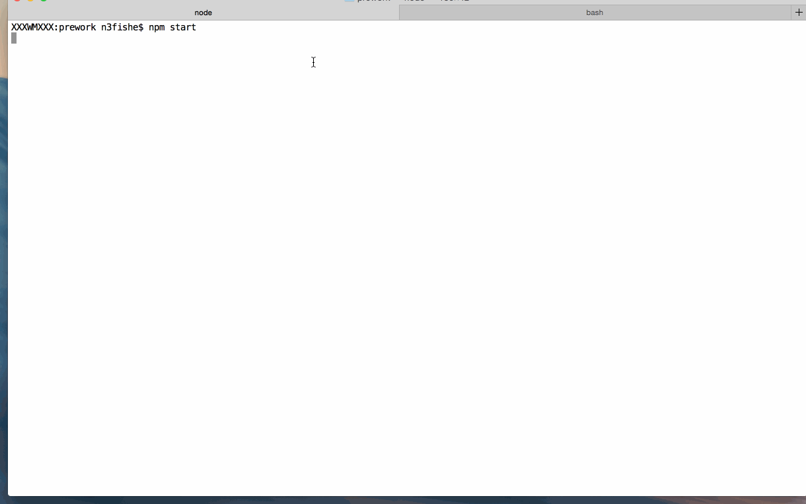

# Proxy Server

This is a Proxy Server for Node.js submitted as the [pre-work](http://courses.codepath.com/snippets/intro_to_nodejs/prework) requirement for CodePath.

Time spent:  4 Hours

Completed:

* [] Required: Requests to port `8000` are echoed back with the same HTTP headers and body
* [] Required: Requests/reponses are proxied to/from the destination server
* [] Required: The destination server is configurable via the `--host`, `--port`  or `--url` arguments
* [] Required: The destination server is configurable via the `x-destination-url` header
* [] Required: Client requests and respones are printed to stdout
* [] Required: The `--logfile` argument outputs all logs to the file specified instead of stdout





## Starting the Server

```bash
npm start
```

## Features

### Echo Server:

```bash
curl -v http://127.0.0.1:8000/asdf -d "Hello Dr. Fisher, I'm am the echo server"
*   Trying 127.0.0.1...
* Connected to 127.0.0.1 (127.0.0.1) port 8000 (#0)
> POST /asdf HTTP/1.1
> Host: 127.0.0.1:8000
> User-Agent: curl/7.43.0
> Accept: */*
> Content-Length: 40
> Content-Type: application/x-www-form-urlencoded
> 
* upload completely sent off: 40 out of 40 bytes
< HTTP/1.1 200 OK
< host: 127.0.0.1:8000
< user-agent: curl/7.43.0
< accept: */*
< content-length: 40
< content-type: application/x-www-form-urlencoded
< Date: Mon, 14 Mar 2016 04:49:15 GMT
< Connection: keep-alive
< 
* Connection #0 to host 127.0.0.1 left intact
Hello Dr. Fisher, I'm am the echo server
```

### Proxy Server:

Port 8001 will proxy to the echo server on port 8000.

```bash
curl -v http://127.0.0.1:8001/asdf -d "Hello Dr. Fisher, I'm am the proxy server"
*   Trying 127.0.0.1...
* Connected to 127.0.0.1 (127.0.0.1) port 8001 (#0)
> POST /asdf HTTP/1.1
> Host: 127.0.0.1:8001
> User-Agent: curl/7.43.0
> Accept: */*
> Content-Length: 41
> Content-Type: application/x-www-form-urlencoded
> 
* upload completely sent off: 41 out of 41 bytes
< HTTP/1.1 200 OK
< host: 127.0.0.1:8001
< user-agent: curl/7.43.0
< accept: */*
< content-length: 41
< content-type: application/x-www-form-urlencoded
< connection: close
< date: Mon, 14 Mar 2016 04:49:30 GMT
< 
* Closing connection 0
Hello Dr. Fisher, I'm am the proxy server
```

### Configuration:

#### CLI Arguments:

The following CLI arguments are supported:

##### `--host`

The host of the destination server. Defaults to `127.0.0.1`.

##### `--port`

The port of the destination server. Defaults to `80` or `8000` when a host is not specified.

##### `--log`

Specify a file path to redirect logging to.

#### Headers

The follow http header(s) are supported:

##### `x-destination-url`

Specify the destination url on a per request basis. Overrides and follows the same format as the `--url` argument.

